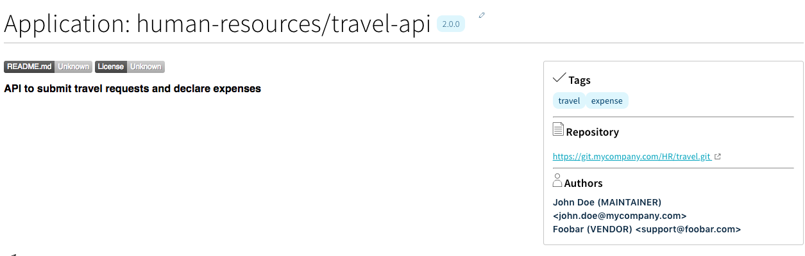
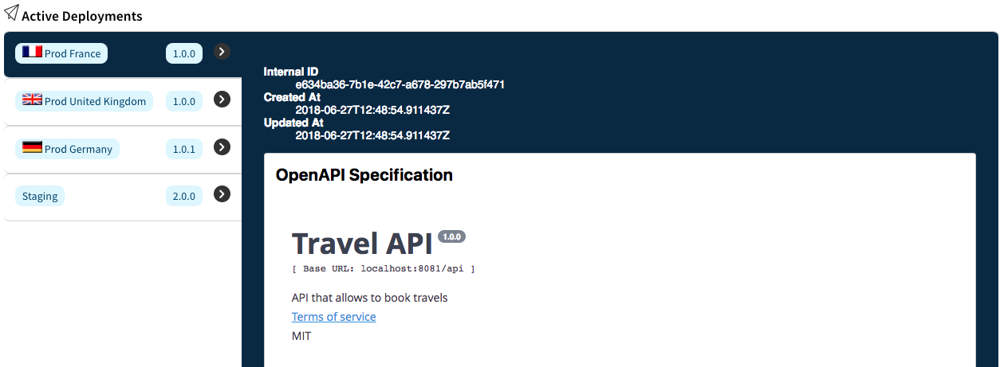

# Lhasa

Micro-services urban planning at scale.

List and map applications of your micro service information system and how they interact. Track your business 
processes and domains, then gamify the continuous enhancement of your system.

## Features

### Application catalog

Applications of your information system are grouped in *business domains*.
Meta data about each application version should be stored directly in the codebase (see: manifest files) and are
collected to be presented in the user interface.



### Deployment tracking

Each time you deploy a release on a given environment you can notify *Lhasa* API and track which version is available on
each environment.



## Contact

Made with love by OVH Urban Planning team.

### Authors

* Rayene Ben Rayana <rayene.ben-rayana@corp.ovh.com>
* Fabien Meurillon <fabien.meurillon@corp.ovh.com>
* Yannick Roffin <yannick.roffin@corp.ovh.com>

## Technical overview

This project is currently at very early stage and under active development. It is mainly written in golang and in angular5.

## Build project

### Requirements

* Git
* [Go installation](https://golang.org/doc/install) and [workspace](https://golang.org/doc/code.html#Workspaces) (`GOROOT` and `GOPATH` correctly set)
* GNU Make
* [dep](https://github.com/golang/dep) - Go dependency management tool
* [Angular 5 CLI](https://angular.io/guide/quickstart) - Management CLI for angular 5

### Steps

Git clone the project in your `$GOPATH` then run the default Makefile target:

```
go get $GOPATH/src/github.com/ovh/lhasa/api/cmd/appcatalog
```

## Run project

### Requirements

* PostgreSQL 9.4 or later

#### Steps
 
##### Start requirements

If you don't have a postgres instance, you can start one locally using [docker-compose]:

```
$ PORT=100 docker-compose up # $PORT is appended with '32' as listening port. "10032" in this example.
```

[docker-compose]: https://docs.docker.com/compose/

##### Configuration file

Copy `config.json.dist` as `config.json` and edit the latest to match your database configuration:

```json
{
    "appcatalog-db": {
        "writers": [
            {
                "host": "localhost",
                "port": 10032,
                "sslmode": "disable"
            }
        ],
        "database": "postgres",
        "user": "postgres",
        "password": "appcatalog",
        "type": "postgresql"
    }
}
```

##### Build and run Lhasa

```
cd $GOPATH/src/github.com/ovh/lhasa
APPCATALOG_AUTO_MIGRATE=1 make run
```

Lhasa will start and listen on port `8081`.

Note that `APPCATALOG_AUTO_MIGRATE=1` will perform database schema migrations/creations automatically.

##### Load the sample dataset (optional)

Optionally, you can load the sample dataset to immediately start playing:

```
API_BASE_URL=http://localhost:8081/api ./samples/mycompany.sh
```
